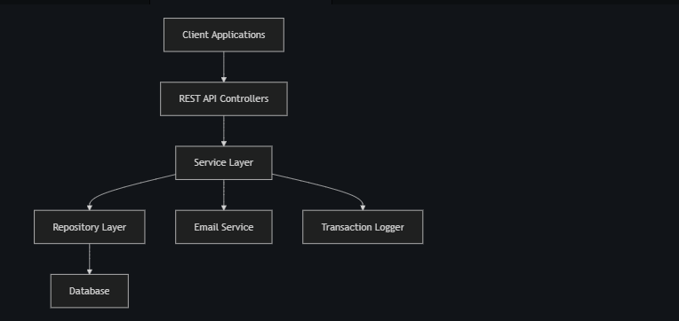

This banking system backend implementation fulfills all the requirements :

1. ✅ Customer management with registration and details
2. ✅ Account management with balance tracking
3. ✅ Transaction processing (deposits and withdrawals)
4. ✅ Money transfers between accounts
5. ✅ Transaction records and history
6. ✅ Email notifications for transactions
7. ✅ Message logging for all transactions

The system is built using:

- Spring Boot for the backend framework
- JPA/Hibernate for database operations
- PostgreSQL as the relational database
- RESTful API design principles
- Proper exception handling and validation
- Email service integration

System Architecture

Database schema

    CUSTOMER {
        long id PK
        string firstName
        string lastName
        string email
        string mobile
        date dob
        datetime lastUpdateDateTime
    }
    ACCOUNT {
        long id PK
        long customerId FK
        string accountNumber
        decimal balance
        string accountType
        datetime creationDate
    }
    TRANSACTION {
        long id PK
        long accountId FK
        string type
        decimal amount
        datetime bankingDateTime
        string status
    }
    TRANSFER {
        long id PK
        long fromAccountId FK
        long toAccountId FK
        decimal amount
        datetime bankingDateTime
        string status
    }
    MESSAGE {
        long id PK
        long customerId FK
        string message
        datetime dateTime
    }
    
    CUSTOMER ||--o{ ACCOUNT : "has"
    ACCOUNT ||--o{ TRANSACTION : "performs"
    ACCOUNT ||--o{ TRANSFER : "sends"
    ACCOUNT ||--o{ TRANSFER : "receives"
    CUSTOMER ||--o{ MESSAGE : "receives"